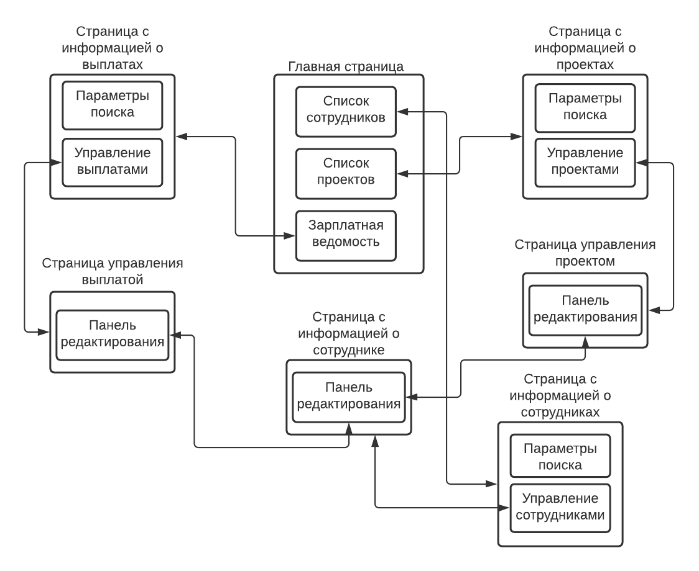

# Web-приложение для работы с зарплатной ведомостью предприятия
## Часть 1. 

Схема базы данных:

Схема навигации между страницами:

Описание страниц:

1. Главная страница:

Начальная точка использования - содержит ссылки на страницы (2), (3), (4). 

2. Страница с информацией о сотрудниках: 

Основной элемент страницы - список всех сотрудников, в котором отображаются ФИО и должность, с поддержкой поиска по проектам, диапазону з/п, должностям и т.п.
Возможен переход на главную страницу (1) и по результатам поиска на страницу сотрудника (3).

3. Страница с информацией о сотруднике:

4. Страница с информацией о проектах:

5. Страница управления проектом:

6. Страница с информацией об операциях:

7. Страница управления операцией:
