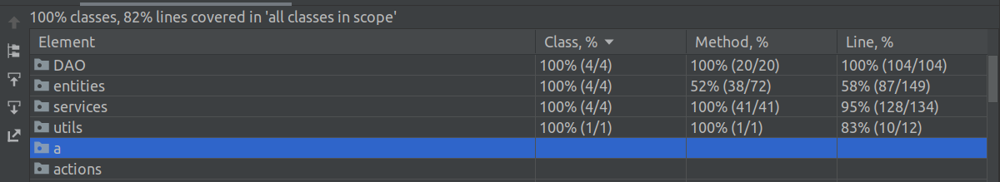

# Web-приложение для работы с зарплатной ведомостью предприятия

#### Покрытие тестами:

#### Схема базы данных:

#### Схема навигации между страницами:

#### Описание страниц:

С любой страницы можно перейти на (1), (2), (3).

1. *Страница со списком сотрудников:*

  Содержит список сотрудников, можно перейти на страницы (4), (5), (6), (7). Также можно уволить или удалить сотрудника.

2. *Страница со списком выплат:* 

  Содержит список выплат, можно перейти на (10), (11). Можно удалить выплату.
  
3. *Страница со списком проектов:*

  Содержит список проектов, можно перейти на (8), (9). Также можно закрыть или удалить проект. 
  
4. *Страница с информацией о сотруднике:*
  
  Приводится полная информация о сотруднике - информация о нем, история его выплат, участия в проектах.

5. *Страница добавления сотрудника:*

  Содержит поля для ввода данных о новом сотруднике. Можно перейти на (1).

6. *Страница редактирования сотрудника:*

  Содержит поля для редактирования данных о сотруднике. Можно перейти на (1).
  
7. *Страница назначения сотрудника на новую роль/проект:*

  Содержит поля для ввода данных о новой роли/проекте. Можно перейти на (1).
  
8. *Страница добавления проекта:*

  Содержит поля для ввода данных о новом проекте. Можно перейти на (3).
  
9. *Страница редактирования проекта:*

  Содержит поля для редактирования данных о проекте. Можно перейти на (3).
 
10. *Страница добавления выплаты:*

  Содержит поля для ввода данных о новой выплате. Можно перейти на (2).
  
11. *Страница редактирования выплаты:*

  Содержит поля для редактирования данных о выплате. Можно перейти на (2).

#### Сценарии использования:

1. *Посмотреть историю карьеры или историю выплат сотрудника*

  Из списка сотрудников перейти на страницу с информацией о нем.
  
2. *Назначение служащего на новую должность, добавление в проект*

  Из списка сотрудников перейти на страницу добавления роли/участия в проекте.

3. *Добавление и удаление сотрудника, чтение и редактирование данных о нем*

  На соответсвующие страницы переходим из списка сотрудников.
 
4. *Добавление и удаление проекта, чтение и редактирование данных о нем*

  На соответсвующие страницы переходим из списка проектов.
 
5. *Добавление и удаление политик выплат, чтение и редактирование данных о них*

  На соответсвующие страницы переходим из списка вылплат.
