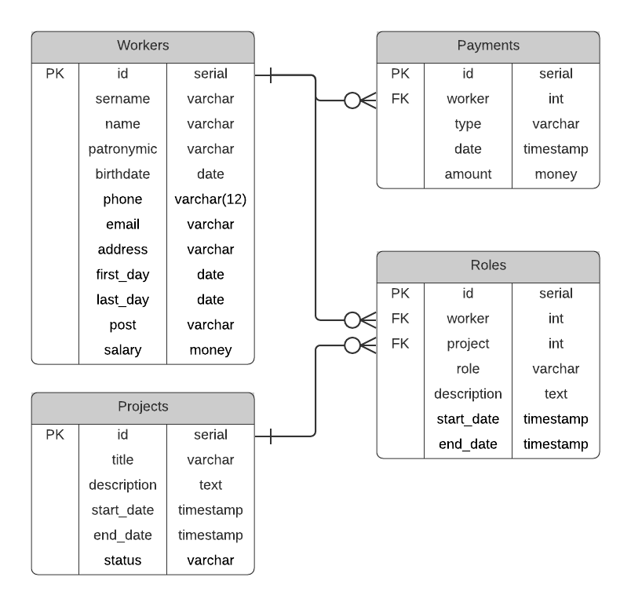
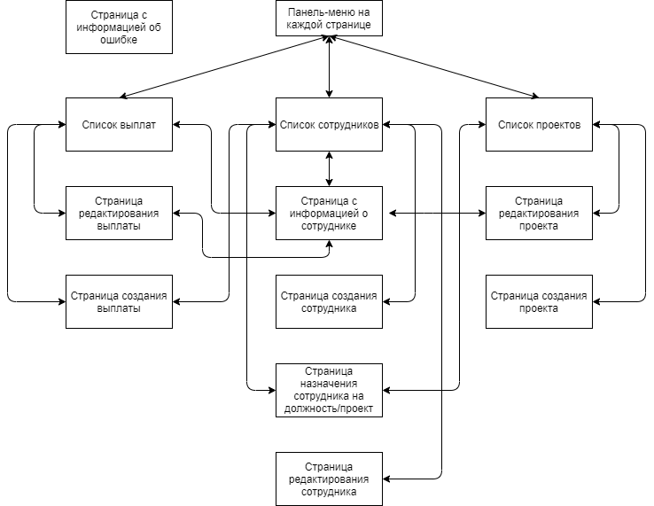

# Web-приложение для работы с зарплатной ведомостью предприятия
## Часть 1. 

#### Схема базы данных:

#### Схема навигации между страницами:

#### Описание страниц:

1. *Главная страница:*

  Начальная точка использования - содержит ссылки на страницы (2), (3), (4). 

2. *Страница с информацией о сотрудниках:* 

  Основной элемент страницы - список всех сотрудников, в котором отображаются ФИО и должность, с поддержкой поиска(по имени, также можно установить фильтры по проектам, диапазону з/п, должностям и т.п.).
  Возможен переход на главную страницу (1) и по результатам поиска на страницу сотрудника (3).

3. *Страница с информацией о сотруднике:*

  Здесь находится вся доступная информация о сотруднике, с этой страницы можно ее редактировать. Можно добавлять/удалять сотрудников. С этой страницы можно перейти на страницу проекта (5), на страницу управления выплатой (7), также вернуться на страницу (2).

4. *Страница с информацией о проектах:*
  
  Здесь отображается список всех проектов с возможность поиска(по названию проекта, описанию, и фильтрами по датам начала/завершения, по количеству сотрудников - участников, по статусу). Можно создавать/удалять проекты. Для создания, редактирования и просмотра подробной информации можно перейти на страницу (5).

5. *Страница управления проектом:*

  Здесь находится вся информация о проекте с возможностью редактирования. От списка сотрудников, участвующий в проекте, можно перейти на страницу (3).

6. *Страница с информацией о выплатах:*

  Здесь также списком приводится информация о последних выплатах с возможность создания, поиска(с фильтрами по проектам, по сотрудникам(можно выбрать несколько), по времени), удаления. Для редактирования/создания можно перейти на страницу (7).
  
7. *Страница управления выплатой:*

  Здесь находится информация о выплате, производится ее редактирование/создание. Можно перейти к списку всех выплат (6).

#### Сценарии использования:

1. *Получить список сотрудников, удовлетворяющих определенным требованиям*

  Главная страница (1) -> переходим по [*Сотрудники*] -> Страница с информацией о сотрудниках (2) -> устанавливаем параметры поиска -> после нажатия [*Ок*] проиводится поиск и выводится результат.

2. *Посмотреть историю карьеры или историю выплат сотрудника*

  Главная страница (1) -> переходим по [*Сотрудники*] -> Страница с информацией о сотрудниках (2) -> производим поиск по имени или устаналиваем параметры -> переходим по сотруднику из списка -> Страница с информацией о сотрудник (3) -> здесь есть разделы с историей выплат и участия в проектах.

3. *Изменение списка участников проекта/изменение роли в проекте*

  Главная страница (1) -> переходим по [*Проекты*] -> Страница с информацией о проектах (4) -> находим необходимый проект -> переходим по [*Информация*] на этом проекте на (5) -> тут есть список сотрудников - можно изменить роль у любого сотрудника или сам список -> изменение роли происходит простым изменением значения поля с ролью, а для добавления сотрудника после нажатия [*Добавить*] под ней развернется небольшое окно со списком сотрудников.

4. *Запланировать выплату премии для определенной категории сотрудников*

  Главная страница (1) -> переходим по [*Выплаты*] -> Страница с информацией о выплатах (6) -> переходим по [*Добавить выплату*] на страницу (7) -> создаем необходимую выплату и выбираем список сотрудников -> создастся отдельная выплата для каждого сотрудника из списка.
 
5. *Узнать общую сумму выплат сотрудника в этом месяце*

  Главная страница (1) -> переходим по [*Выплаты*] -> Страница с информацией о выплатах (6) -> в параметрах поиска устанавливаем временной интервал -> после нажатия [*Ок*] проиводится поиск и выводится результат.
 
